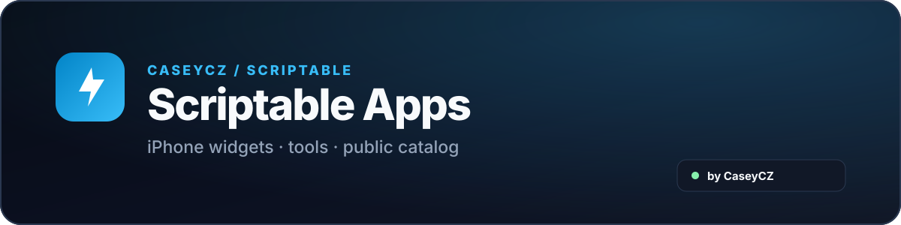

  

  
  

  A collection of custom <strong>Scriptable</strong> apps and iPhone widgets with a public catalog.

  

## Apps

<table>
  <thead><tr><th>App</th><th>Version</th><th>Info</th><th>Link</th></tr></thead>
  <tbody>
    <tr><td><strong>LockScreen Generator</strong></td><td><code>v2.10.0</code></td><td>A tool for creating a custom iPhone Lock Screen look.</td><td></td></tr>
    <tr><td><strong>Sports Info</strong></td><td><code>v2.5.30</code></td><td>A universal sports widget for multiple sports and competitions.</td><td></td></tr>
    <tr><td><strong>Sports Live</strong></td><td><code>planned</code></td><td>A widget focused on quick live scores across sports.</td><td></td></tr>
  </tbody>
</table>

## About

Scriptable Apps are practical tools for everyday iPhone use. Each app has its own README, install file and overview of the main features.

  
  

## Support

  

   
  Scan the QR code or click the button.

  

