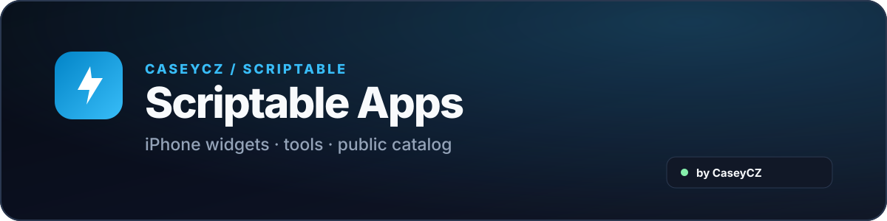

  

  
  

  A collection of <strong>Scriptable</strong> apps and iPhone widgets — some are original projects, while others are based on public Scriptable scripts that we significantly modified and expanded.

  

## Apps

<!-- App versions are synchronized automatically from APP_VERSION in each production script. -->

<table>
  <thead><tr><th>App</th><th>Version</th><th>Info</th><th>Link</th></tr></thead>
  <tbody>
    <tr><td><strong>LockScreen Generator</strong></td><td><code>v2.10.2</code></td><td>A tool for creating a custom iPhone Lock Screen look.</td><td></td></tr>
    <tr><td><strong>Sports Info</strong></td><td><code>v2.5.41</code></td><td>A universal sports widget for multiple sports and competitions.</td><td></td></tr>
    <tr><td><strong>Sideload Watch</strong></td><td><code>v0.2.25</code></td><td>Tracks new versions of selected sideload apps from the iOS-Hub catalog.</td><td></td></tr>
    <tr><td><strong>Home Dashboard</strong></td><td><code>v0.3.13</code></td><td>A dashboard for websites, servers, JSON APIs, GitHub and the local network.</td><td></td></tr>
    <tr><td><strong>Homebridge Status</strong></td><td><code>v0.1.13</code></td><td>Homebridge monitoring with automatic LAN → VPN fallback, customizable appearance, notifications and multiple widget sizes.</td><td></td></tr>
    <tr><td><strong>Sports Live</strong></td><td><code>v0.3.3</code></td><td>A development widget for a fast live overview of one selected team across sports.</td><td></td></tr>
  </tbody>
</table>

## About

Scriptable Apps are practical tools for everyday iPhone use. Each app has its own README and an overview of its main features.

## Origin and credits

For projects that started from an existing public script, we credit the original reference and authors directly in the app README:

- **LockScreen Generator** — based on [LSWeather](https://github.com/ajatkj/scriptable/blob/master/LSWeather.js) by [ajatkj / Ankit Jain](https://github.com/ajatkj).
- **Homebridge Status** — based on [homebridgeStatusWidget](https://github.com/lwitzani/homebridgeStatusWidget) by [lwitzani](https://github.com/lwitzani).
- **Sports Live** — based on [ONE-NBA](https://github.com/Nicolasking007/Scriptable/tree/main/ONE-NBA) by **Nicolas-kings**, which builds on the [NBA MyTeam widget](https://github.com/thisisevanfox/nba-my-team-ios-widget) by [thisisevanfox](https://github.com/thisisevanfox); the ONE-NBA source header credits both **thisisevanfox & Nicolas-kings**.
- **Sports Info** — our own multi-sport implementation, designed using the architecture of our LockScreen Generator as a reference.

These projects were subsequently substantially redesigned and expanded beyond their original references; details are documented in each app README.

  
  

## Support

  

   
  Scan the QR code or click the button.

  

