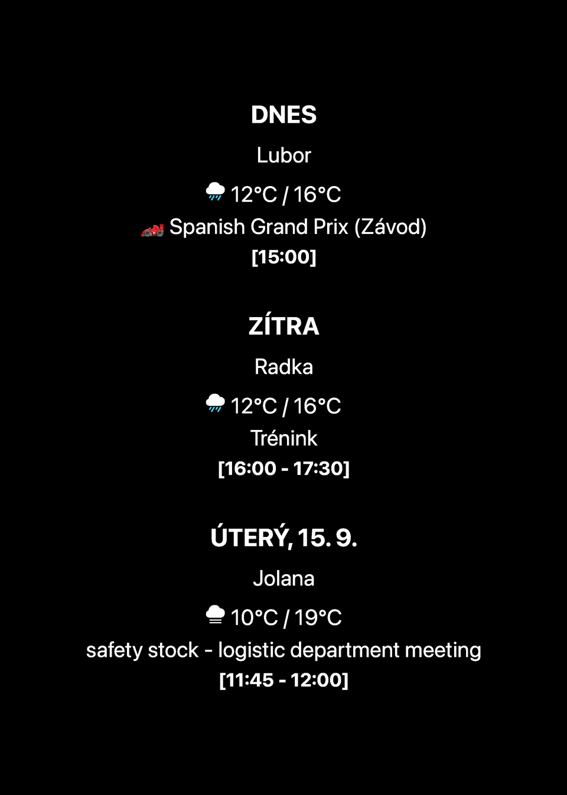

# 🪄 LockScreen Generator

### Moderní dynamická tapeta pro iPhone vytvořená v Scriptable
### A modern dynamic iPhone Lock Screen wallpaper generator for Scriptable

**[📲 Instalovat do Scriptable](./LockScreenGenerator.scriptable)** · **[🌐 Scriptable Apps web](https://caseycz.github.io/Scriptable/)** · **[⬇️ Stáhnout .js](./LockScreenGenerator.js)** · **[ Scriptable pro iPhone](https://apps.apple.com/app/scriptable/id1405459188)**

---

## 🇨🇿 Čeština

### ✨ Co to je

`LockScreenGenerator.js` vytváří vlastní tapetu pro zamykací obrazovku iPhonu podle toho, co chceš opravdu vidět. Moduly lze zapínat, vypínat, přesouvat a upravovat přímo v moderním nastavení.

> **Jeden JavaScript soubor. Žádné další moduly. Žádná povinná placená API.**

### 🚀 Hlavní funkce

| | Funkce | Co umí |
|---|---|---|
| 🎛️ | **Moderní nastavení** | tmavý dashboard, rychlé presety, kompaktní layout |
| 👁️ | **Živý náhled** | tapetu zobrazí ještě před uložením |
| 📐 | **Auto Fit** | automaticky zmenší obsah, když se nevejde |
| 📱 | **Různé iPhony** | rozložení se přepočítává podle skutečného rozlišení |
| 🔄 | **Aktualizace v aplikaci** | kontrola a instalace nové verze bez dalšího updater skriptu |
| 🛟 | **Fail-open API** | výpadek jednoho zdroje nezablokuje nastavení ani ostatní moduly |
| 🔐 | **Soukromé nastavení** | kalendáře, připomínky a API klíče zůstávají lokálně u uživatele |
| 🌍 | **4 jazyky** | Čeština, English, Deutsch, Español |

### 🧩 Moduly

| Osobní | Online | Systém a další |
|---|---|---|
| 📅 Kalendář | 🌤 Počasí | 🔋 Baterie |
| ✅ Připomínky | ⛅ Předpověď | ⚙️ Informace o zařízení |
| 📝 Poznámka | 🏎 Formula 1 | 🌙 Fáze Měsíce |
| ⏳ Odpočet | 🏆 Sport | 🌐 Světový čas |
| 🏃 Kroky / aktivita | 📈 Akcie | 💬 Citát |
|  | 🪙 Kryptoměny | 🎂 Jmeniny |
|  | 💱 Kurzy měn | 📰 RSS zprávy |

### ⚡ Rychlá instalace

1. Nainstaluj **[Scriptable z App Storu](https://apps.apple.com/app/scriptable/id1405459188)** a jednou ho spusť.
2. Na iPhonu zkus **[📲 Instalovat do Scriptable](./LockScreenGenerator.scriptable)**. Pokud iOS soubor jen stáhne, otevři `LockScreenGenerator.scriptable` ze Stažených / aplikace Soubory. Alternativně stáhni **[`LockScreenGenerator.js`](./LockScreenGenerator.js)**.
3. Ulož soubor do složky **Scriptable** v iCloud Drive nebo zkopíruj jeho obsah do nového skriptu.
4. Spusť skript.
5. Při úplně prvním spuštění vyber jazyk.
6. Nastav moduly a klepni na **👁 Náhled tapety**.

### 📅 Kalendáře a připomínky

Aplikace neobsahuje žádné přednastavené osobní kalendáře ani seznamy.

V sekci **Kalendář a připomínky** použij **🔄 Načíst z tohoto iPhonu**. Scriptable načte kalendáře a seznamy Připomínek dostupné právě na daném telefonu a uživatel si zaškrtne pouze ty, které chce zobrazovat. Bez výběru se automaticky nezobrazuje všechno.

### 🌤 API a zdroje

Základní funkce jsou navržené tak, aby fungovaly **bez vlastních API klíčů**, pokud existuje bezplatný veřejný zdroj.

| Modul | Výchozí zdroj | Vlastní API |
|---|---|---|
| 🌤 Počasí | Open-Meteo, bez klíče | volitelně OpenWeatherMap |
| 🏎 Formula 1 | Jolpica / Ergast kompatibilní | není nutné |
| 🏆 Sport | ESPN | není nutné |
| 📈 Akcie | Yahoo Finance | volitelně Alpha Vantage |
| 🪙 Krypto | Coinbase | není nutné |
| 💱 Kurzy | free exchange-rate zdroj | volitelně ExchangeRate-API |
| 📰 Zprávy | vlastní RSS URL | bez API klíče |

V **🔑 API a zdroje** lze u podporovaných modulů vložit vlastní klíč. Klíče nejsou součástí veřejného JS, ukládají se jen do `LockScreenGenerator_settings.json` a při exportu nastavení do JSON se záměrně vynechávají.

### 🛟 Fail-open chování

Nefunkční API nesmí shodit aplikaci. Když některý zdroj neodpovídá, nastavení se pořád otevře, ostatní moduly fungují dál, použije se cache, pokud existuje, a jinak se daný blok přeskočí. Diagnostika zobrazí chybu místo pádu aplikace.

### 👁️ Živý náhled + Auto Fit

**Náhled tapety** používá aktuální rozepsané nastavení a ukáže výsledek ještě před zavřením dashboardu.

**Auto Fit** při přetečení obsahu provede kontrolní render, změří výslednou výšku, podle potřeby zmenší obsah a respektuje minimální povolené měřítko.

### 🏎 Formula 1

F1 je samostatný modul. Lze nezávisle zapnout tréninky, kvalifikaci, sprint a závod.

### 🔄 Aktualizace přímo z aplikace

Vedle verze v horní části nastavení je tlačítko **↻ Aktualizace**. První klepnutí zkontroluje novou verzi. Pokud existuje, zobrazí se **⬇️ Aktualizovat na vX.Y.Z**. Před přepsáním se vytvoří `LockScreenGenerator_backup.js`, aktualizuje se pouze skript a `LockScreenGenerator_settings.json` zůstává zachovaný.

Kontrola aktualizace se nespouští automaticky při startu, takže nedostupný GitHub nemůže zablokovat otevření aplikace.

### 🧪 Diagnostika

Diagnostika kontroluje například `Kalendář` · `Připomínky` · `Počasí` · `F1` · `ESPN` · `Yahoo Finance` · `Coinbase` · `Kurzy` · `RSS`.

Stavy: 🟢 **V pořádku** · ⚪ **Vypnuto** · 🔴 **Chyba** · 🟡 **Kontroluji…**

### 💾 Nastavení a soubory

| Soubor | Účel |
|---|---|
| `LockScreenGenerator.js` | hlavní aplikace |
| `LockScreenGenerator_settings.json` | lokální nastavení uživatele |
| `LockScreenWallpaper.png` | výsledná tapeta |
| `LockScreenPreview.png` | ořezaný náhled pro README a web |
| `LockScreenGenerator_backup.js` | záloha před samoaktualizací |
| `LockScreenGenerator_steps.txt` | volitelný vstup kroků ze Zkratek |

### ⚙️ Automatizace přes Apple Zkratky

Skript uloží `LockScreenWallpaper.png` a vrátí cestu k výsledku. Ve Zkratkách pak stačí přibližně: **Spustit Scriptable skript → získat obrázek → Nastavit tapetu Lock Screenu**.

---

## 🇬🇧 English

### ✨ What it is

`LockScreenGenerator.js` builds a configurable iPhone Lock Screen wallpaper from the modules you actually want. Everything is controlled from a modern settings dashboard.

> **One JavaScript file. No extra modules. No mandatory paid APIs.**

### 🚀 Highlights

| | Feature | What it does |
|---|---|---|
| 🎛️ | **Modern settings** | dashboard UI, quick presets, compact layout |
| 👁️ | **Live preview** | preview the wallpaper before saving |
| 📐 | **Auto Fit** | automatically scales overflowing content |
| 📱 | **Responsive iPhone layout** | uses the device's real screen resolution |
| 🔄 | **In-app updates** | check and install a new version without a separate updater |
| 🛟 | **Fail-open APIs** | one broken service never blocks settings or unrelated modules |
| 🔐 | **Private configuration** | calendars, reminders and API keys stay local |
| 🌍 | **4 languages** | Czech, English, German and Spanish |

### ⚡ Quick install

1. Install **[Scriptable from the App Store](https://apps.apple.com/app/scriptable/id1405459188)** and open it once.
2. On iPhone, try **[📲 Install in Scriptable](./LockScreenGenerator.scriptable)**. If iOS only downloads the file, open `LockScreenGenerator.scriptable` from Downloads / Files. Alternatively download **[`LockScreenGenerator.js`](./LockScreenGenerator.js)**.
3. Save it into Scriptable's iCloud Drive folder or paste the code into a new Scriptable script.
4. Run it and choose your language on the first launch.
5. Configure modules and use **👁 Wallpaper preview**.

### 📅 Calendars and reminders

Use **🔄 Load from this iPhone**. The script discovers calendars and Reminder lists available on that device and lets each user select only the sources they want. Nothing personal is bundled in the public script.

### 🌤 APIs and data sources

The default configuration works without personal API keys whenever a free public source exists: Open-Meteo for weather, Jolpica for Formula 1, ESPN for sports, Yahoo Finance for stocks, Coinbase for crypto, a free exchange-rate endpoint, and custom RSS feeds. Optional personal API providers are available for supported modules.

Private API keys are stored only in the user's settings file and are intentionally removed from exported settings JSON.

### 🛟 Fail-open behavior

If a data source fails, settings still open, unrelated modules keep working, cached data may be used and the failed block is skipped if no cache exists.

### 🔄 In-app self update

The **↻ Update** button next to the version checks GitHub only after the user taps it. When a new version is available, the current script is backed up to `LockScreenGenerator_backup.js` before replacement. User settings are not overwritten.

---

### 📱 Scriptable Apps

Naše aplikace i vybrané projekty dalších vývojářů najdeš na našem webu.  
Our apps and selected community projects are available on our website.

**https://caseycz.github.io/Scriptable/**

Built for **Scriptable + iPhone + Shortcuts**

