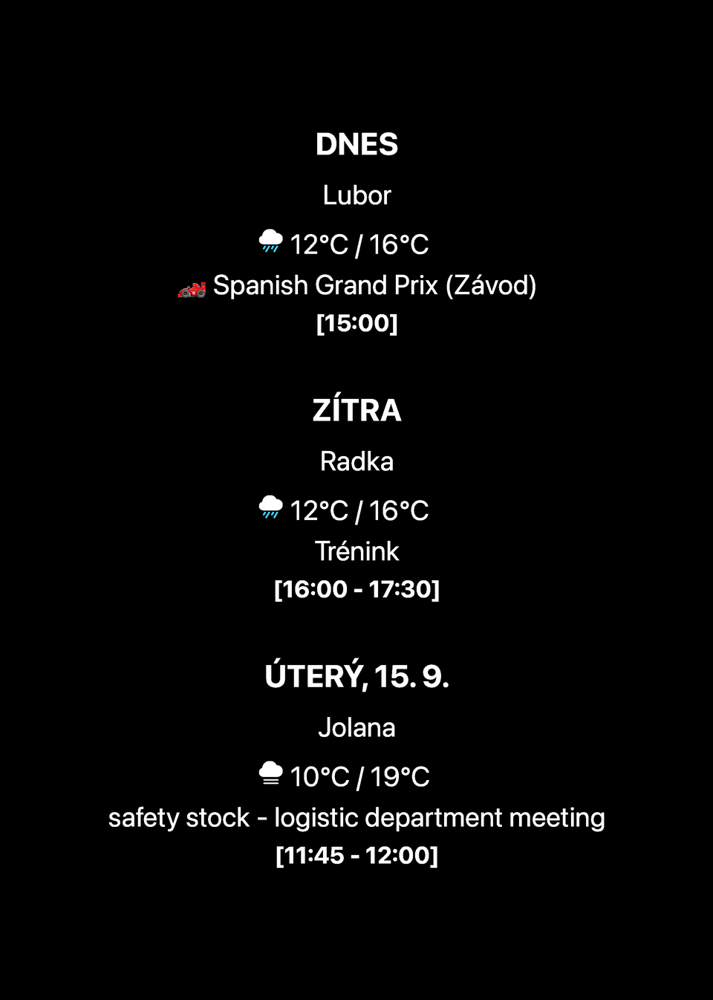

  

  
  

<h1 align="center">🪄 LockScreen Generator</h1>

  A <strong>Scriptable</strong> tool for creating a custom dynamic iPhone Lock Screen wallpaper.

  

  
  

## What it does

**LockScreen Generator** creates a personalized iPhone Lock Screen wallpaper. Add your calendar, weather, sports and other useful information on top of a photo.

## What your wallpaper can show

- 📅 Calendar events and reminders.
- 🌤️ Weather and forecasts.
- 🏎️ Formula 1 and other sports information.
- 📈 Stocks, cryptocurrencies and exchange rates.
- 🌙 World time, Moon phases and other information.
- 👁️ A live preview before using the wallpaper.
- 🎨 Custom appearance, information order and automatic sizing for your iPhone.

  

## Getting started

1. Install **LockScreen Generator** in Scriptable and open its settings.
2. Choose the information you want on your wallpaper.
3. Under **Wallpaper**, choose where the background photo comes from.
4. Check the result in the preview.
5. Add the matching Apple Shortcut to create and set your wallpaper.

## Two ways to choose a photo

**Photo saved in the generator:** Choose one photo in the app settings. The generator reuses it as the background for future wallpapers.

**Photo from Shortcuts:** A Shortcut selects a photo from an album and passes it to the generator. For example, it can choose a random photo from your selected album.

## Apple Shortcuts for setting your wallpaper

- [⚡ Direct setup – photo saved in the generator](https://www.icloud.com/shortcuts/869bc40bbd494f5481b6c5ba1caab016)
- [🖼️ Album setup – photo selected by the Shortcut](https://www.icloud.com/shortcuts/05f7231904014644a75cedb18c943545)

## Good to know

The generator creates the wallpaper image; Apple Shortcuts set it as your wallpaper and can run it on a schedule. Some information modules require permission to access their data.

## Origin and credits

Inspired by [LSWeather](https://github.com/ajatkj/scriptable/blob/master/LSWeather.js) by [ajatkj (Ankit Jain)](https://github.com/ajatkj). The current generator has since been extensively redesigned with its own settings, appearance and additional information modules.

## Links

  
  

## Support

  

   
  Scan the QR code or click the button.

